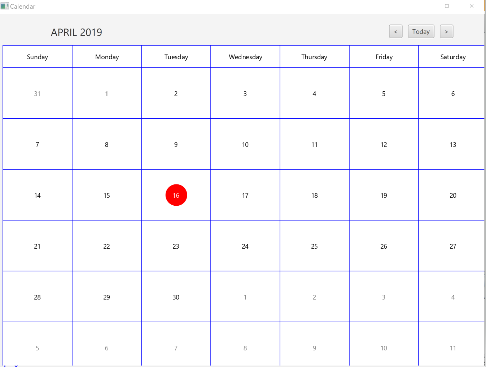

   ## Calendar App

   * This program produces a digital calendar that displays current month, year and date with red circle.
   * It also displays next, previous and Today button for user to navigate through.
   * If there are empty cell on the calendar, the cell is filled with dates from previous moth or next month accordingly.

   * Below is a picture of the program when it is run.

     

     
